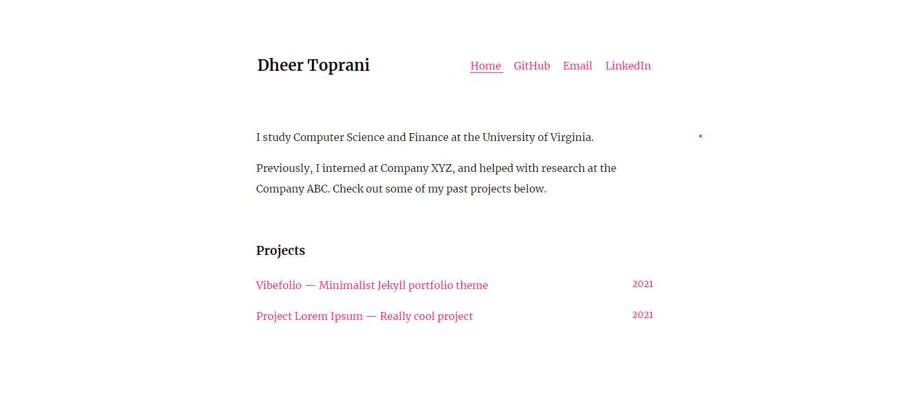

# Vibefolio

## What is this?
Vibefolio is a minimalist [Jekyll](https://jekyllrb.com) theme made for text-focused online portfolios. The out-of-the-box template supports:

1. A homepage that displays a brief introduction and the most recent portfolio projects in chronological order.
2. Links to sample projects

## How to set up

1. Clone the repository.
2. Edit `_config.yml`. Replace the sample text in the first section as denoted by the code comments.
3. Replace the sample text in the `index.md` file.
3. Add future **projects** as Markdown `(.md)` files to the `_projects` folder. 

## Google Analytics
You can add the Javascript into the `home.html` [layout](https://jekyllrb.com/docs/layouts/) right above the `</body>` tag.

## Future Updates
Vibefolio is currently in v0.1.3. I initially created this theme for my [personal website](https://dheerkt.com), where I didn't need to build additional pages like blog posts, contact page, about page, etc. As I eventually update my personal website to add these features, I will update this repository as well. No concrete plans or timeline as of now.